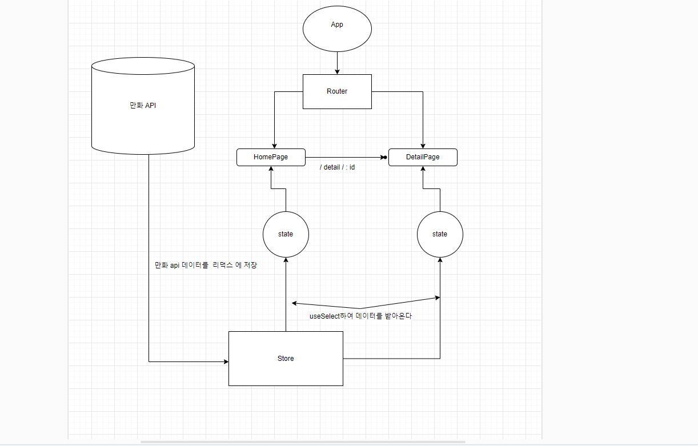

# 만들게 된 동기 

나는  `나루토` 만화 팬입니다. 그런데 `나루토` 이외에 만화를 접하다보니 만화에 대한 정보를 보여주는 사이트를  만들고 싶은 마음에 
이것을 만들게 되었습니다.

# 이용한 라이브러리

> react-router-dom

리액트에서 페이지간에 이동을 구현해주는 라이브러리입니다.

> reduxjs/toolkit

`pages` 폴더내에서 Detail과 Home에서 만화 데이터를 쓰기때문에 전역적으로 상태 관리하는 라이브러리인 redux-toolkit을 이용하였습니다.

> styled-components 

다음 2가지이유에 해당 라이브러리를 사용하였습니다

  - javascript로 css를 작성을 한다는 점에서 일관성이 있어보였습니다
  
  - className이 겹치는 문제를 방지할 수 있습니다. 고유 값이 붙습니다. 
   

> axios 

다음 2가지이유에 해당 라이브러리를 사용하였습니다. 

 - axios는 서버에서 데이터를 받아올수 있다는 점에서 사용하였습니다.
 
 - 기존 `fetch`에서는  json형식으로 변환해주었던과 달리  여기서는 
  자동으로   json으로 만들어줍니다.

# 구조도 

 > 프로젝트 도식화

 

# 기능 

 - 검색창에 `검색어`를 입력하면 만화의 제목과 일치하는 만화 보여주기 
 - 만화 클릭하면 만화 상세페이지를 보여주기 

# 사용스택

 언어 : javascript 

 라이브러리 : `위에참고`

 Api : <a href=" https://jikan.moe/ ">Jikan</a>

